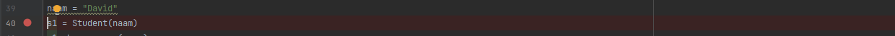
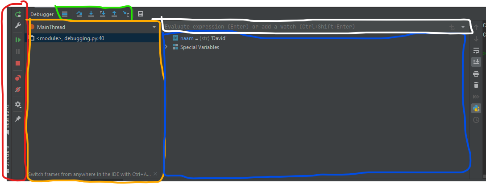

# Debugger 101

(c) 2024 Hogeschool Utrecht 
Auteur: David Isaacs Paternostro

## 1. Debugger basics

De debugger is grofweg een programma dat inzicht geeft in je code. Dit doet het door de staat van je programma op elk moment
live bij te houden. Bovendien biedt het mogelijkheden om deze gegevens op elk moment in te zien en aan te passen.

Je kan de debugger gebruiken op verschillende manieren, maar deze oefening richt zich op het gebruiken van de debugger in PyCharm.
Voor gebruikers van Virtual Studio Code geldt dat alle vragen beantwoord kunnen worden, maar sommige opties hebben in VS Code een ander icoontje of staan op een andere plek.

### 1.1. Draaien

Draai `debugger.py` met de debugger door de file te openen in je IDE en rechts boven in op het kevertje te drukken:

Oké, leuk... maar wat kunnen we hiermee doen?

### 1.2. Breakpoints

Breakpoints zijn punten waar je de code wilt laten stoppen zodat je kan kijken wat op een specifiek moment de staat van je programma is.

> **Oefening 1.**
>
> Plaats een breakpoint op regel 40 van `debugger.py`. Dit kan je doen door met de muis te klikken op de plek van het rode bolletje in het onderstaande plaatje.
>
> Draai de debugger. Je ziet nu dat deze op regel 40 stopt.
>
> 

### 1.3. Debug windows

Onderstaand is een lijstje met de verschillende windows die behoren tot de debugger van PyCharm (in VS Code komt dit behoorlijk overeen). Bijgevoegd is een afbeelding met de windows omcirkeld met elke een eigen kleur:

- debugger toolbar, deel 1 (rood)
- debugger toolbar, deel 2 (groen)
- frames window (geel)
- evaluation bar (wit)
- variables & watches (blauw)

#### Debugger toolbar, deel 1

In deze toolbar vind je knoppen om het programma te:
- laten doordraaien tot de volgende breakpoint: 
- pauseren: 
- stoppen: 

> **Oefening 2.**
>
> Plaats nog een breakpoint op regel 45 en draai de debugger opnieuw. De code stopt nu als het goed is op regel 40. Druk op  om het programma door te laten draaien tot regel 45.
> Druk nogmaals op . Wacht even en druk op . Waar in de code bevinden we ons? Je kan ervoor kiezen om het programma verder te laten draaien. Of, als je denkt dat
> dit te lang gaat duren, druk je op .

#### Debugger toolbar, deel 2

Het tweede deel van de toolbar heeft functies waarmee je:

- naar de volgende regel in het huidige bestand kan gaan: 
- naar de volgende regel, al dan niet een nieuwe functie in: 
- als we een functie in zijn gedoken, er weer uit springen: 

De andere knoppen laten we voor nu achterwege. Step into  en step out  hebben een relatie tot het volgende onderdeel, de frames window, daar komen we straks op terug.

> **Oefening 3.**
>
> Start wederom de debugger. Wanneer je code op regel 40 is gestopt. Ga je met  naar regel 41.
> Vervolgens ga je met  de methode `change_name()` in. Bekijk de code, wat valt je op? Als je de functie hebt bestudeerd,
> ga je uit de functie met . Sluit vervolgens je sessie met .

#### Frames window

Het frames window wordt ook wel de _stack trace_ genoemd. We kunnen hier kijken naar de verschillende _threads_ die draaien.
Per thread zien welke calls er zijn gemaakt, met andere woorden: welke calls er op de stack staan. Een call verwijst naar welke functies er zijn aangeroepen.
Waar er dus bij de toolbar telkens stond dat we een functie in gingen, zou het exacter zijn om te zeggen dat we een nieuwe call in gaan.

> **Oefening 4.**
>
> Zet een breakpoint op regel 42 en draai de debugger tot het programma daar stopt. Bevestig dat op de call stack nu alleen
> "\<module\>, debugger.py:42" staat. Het programma is op dit moment dus bezig met het uitvoeren van de module `debugger.py`.
>
> Ga vervolgens de functie `get_serial()` in met
> . Nu zie je dat er een call aan de stack is toegevoegd: "set_serial, debugger.py".
>
> Ga door tot de regel waar de functie `join()` van de _standard library_ wordt aangeroepen. Je kan daarvoor drie maal  drukken.
> Nu zie je "\<genexpr\>" en "choice, random.py".
>
> Tot slot een leuk feitje: de website 'stackoverflow.com' heeft te maken met de stack die we in ons frames window zien groeien en krimpen naar mate
> we meer function calls doen. Een overflow is wanneer er teveel calls op de stack komen en de stack vol raakt. Hoe groot de stack mag worden kan vaak ingesteld worden in je IDE maar dit is meestal 1MB aan RAM.

#### Evaluation bar, variables & watches

De _variables & watches window_ geeft je de kans om de staat van je programma in te zien. Variables zijn alle waardes die op een specifiek moment
in je programma beschikbaar zijn. Niet alles dat op dit moment beschikbaar is wordt meteen getoond bij je watches en variables. Maar ook niet alles is altijd beschikbaar. De variabelen die
beschikbaar zijn behoren tot je 'scope'.

De _evaluation bar_ geeft je de kans om variabelen te bekijken of aan te passen. Het handige is natuurlijk dat je bijvoorbeeld
een breakpoint kan zetten om op die plek in je programma het een en ander te bekijken. Als je ziet dat een variabele op die plek
nog niet de juiste waarde heeft, kan je zelfs tijdens diezelfde run nog waardes aanpassen om te kijken of je programma dan wél goed zou draaien als die ene waarde daar wel goed zou staan.

Dit kan heel handig zijn als het veel moeite is om je programma tot die specifieke staat te laten komen. Denk bijvoorbeeld aan wanneer je miljoenen datapunten moet verwerken en het halverwege ergens fout lijkt te gaan.

> **Oefening 5.**
>
> Elke variabele heeft een plek in het geheugen van je computer. Dat adres kan je opvragen door de functie `id()` te gebruiken.
>
> Op regel 10 in de code staat `print(id(name))`: deze print het geheugenadres van de variabele `name`. Plaats een breakpoint op regel 40, en voeg een watch toe voor `id(name)`.
> Dit kan door in de evaluation bar "adres=id(naam)" te typen en op enter te drukken. Bepaal nu het volgende:
> - Doe op regel 40 een : is het adres nog beschikbaar in de huidige scope?
> - Is het adres gelijk aan dat van name? Zo ja, wat betekent dat eigenlijk?
> - Op regel 11 staat `name = "Davis"` wat zijn de adressen van `naam` en `name` nu respectievelijk? Verklaar de resultaten.
> - Op regel 6 staat `x=2`, probeer te bepalen of `x` beschikbaar is in de scope van de `__init__()` call. Gebruik de evaluation bar.
> - Ga terug naar de scope in de \<module\> call en bepaal of `name` nog beschikbaar is.
> - Is de waarde van x aangepast? Probeer te beredeneren wat er is gebeurd.
> - Wat zou er gebeuren als we `global x` bovenaan onze `__init__()` methode zouden toevoegen?

> **Oefening 6.**
>
> *Conditional breakpoints* zijn breakpoints die alleen getriggerd worden onder bepaalde omstandigheden. Door met rechter
> muisknop op een breakpoint te klikken kan je een conditie toevoegen.
>
> - Maak gebruik van een conditional breakpoint om erachter te komen wat de waarde van `what_am_i` is op het moment dat `v1` en `v2` voor het eerst gelijk zijn aan elkaar.
> - Wat is de waarde van `what_am_i` op dit moment?
> - Na hoeveel iteraties kwam dit voor?
> - Ga door tot regel 36, hier staat de conditie `if self.name == "David":` en pas `self.name` aan zodat deze gelijk is aan `David` met behulp van de evaluation bar.
